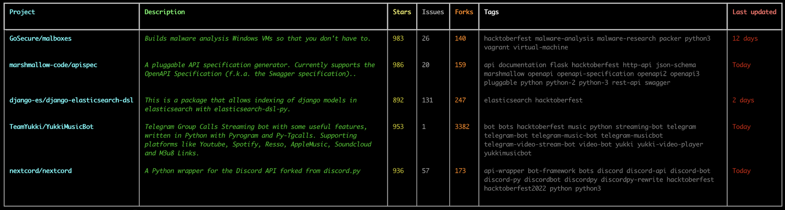

# Scout

⭐ Find hacktoberfest repos from your terminal by getting repos by the range of stars they have  

Have you noticed that often the best repos to contribute to have somewhere between 5-1000 stars? To find these repos on GitHub however, is quite hard! With scout, this issue ends.  

You can search repos with the exact amount of stars you wish as well as your language and additional optional keywords.

## Install

```
pip install gh-scout
```

Before running `scout`:
1. Create a [GitHub token](https://docs.github.com/en/authentication/keeping-your-account-and-data-secure/creating-a-personal-access-token), no extra perms are required for the token.
   1. You can name the token whatever you want, for example: "Scout Token"
   2. You can use tokens that you may already have, and it will work just fine
2. Create an env variable called `SCOUT_TOKEN`, this will be used to ensure you don't get rate limited by GitHub.
   1. On windows, simply type in command prompt ```setx SCOUT_TOKEN <paste-your-github-token>```
   2. On MacOs and Linux, refer [this guide](https://github.com/sindresorhus/guides/blob/main/set-environment-variables.md) on how to set environment variables. In the tutorial, fill ```FOO``` with "SCOUT_TOKEN" and ```bar``` with the generated token from Github. 
3. Remember to refresh your terminal to load the new env variable
4. Now you're good to go! Run `scout` to start!
   1. On windows, press <kbd>win</kbd> + <kbd>r</kbd>, type in `scout`, and click Ok.


## Show Forks Option
```bash
scout --forks
```


## Contributors ❤️
<br>
<h1 align="center">
 <b>Thanks to these amazing people
<h1>
<a href="https://github.com/TechWiz-3/scout/graphs/contributors">
  
</a>
